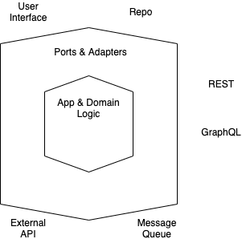

# Building Hexaginal Micro-services with Go

> URL Shortner Application

Provided by `Tensor Programming` - [YoutubeLink](https://www.youtube.com/playlist?list=PLJbE2Yu2zumAixEws7gtptADSLmZ_pscP)

## Basic Concept



- Divide the software such that each component maintains it's `Separation of Concern`
- Application is modular
- App & Domain Logic is the innermost layer
- Ports & Adapters are used to expose the business logic to external world via different interfaces
  - UI
  - Repo (Dbs)
  - REST
  - GraphQL
  - Exernal API
  - Message Queue
- Business logic is itself independent of large framework
  - If framework is used, it is used via ports and adapters
- App & Domain Logic are testable without any of the port and adapter
- Business logic is independent of external IO or agency. It only knows about its own domain only.

## Architecture


- Service : URL Shortner Domain Logic
- Serializer
  - JSON
  - MsgPack
- External API
  - REST API
- Repository
  - MongoDB
  - Redis

## Example

- User supplies URL to shorten

  ```pre
  https://www.google.com -> 929a8-37q
  ```

- On sending the shortened url to our host

  ```pre
  http://localhost:8000/929a8-37q -> https://www.google.com
  ```
