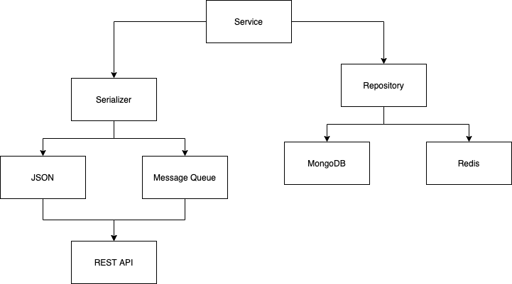

# Building Hexaginal Micro-services with Go

> URL Shortner Application

Provided by `Tensor Programming` - [YoutubeLink](https://www.youtube.com/playlist?list=PLJbE2Yu2zumAixEws7gtptADSLmZ_pscP)

## Basic Concept


- Divide the software such that each component maintains it's `Separation of Concern`
- Application is modular
- App & Domain Logic is the innermost layer
- Ports & Adapters are used to expose the business logic to external world via different interfaces
  - UI
  - Repo (Dbs)
  - REST
  - GraphQL
  - Exernal API
  - Message Queue
- Business logic is itself independent of large framework
  - If framework is used, it is used via ports and adapters
- App & Domain Logic are testable without any of the port and adapter
- Business logic is independent of external IO or agency. It only knows about its own domain only.

## Architecture



- Service : URL Shortner Domain Logic
- Serializer
  - JSON
  - MsgPack
- External API
  - REST API
- Repository
  - MongoDB
  - Redis

## Example

- User supplies URL to shorten

  ```pre
  https://www.google.com -> 929a8-37q
  ```

- On sending the shortened url to our host

  ```pre
  http://localhost:8000/929a8-37q -> https://www.google.com
  ```

## General Flow

```pre
repo  <- service  -> serializer  -> http
```

- service connects to a repository via port
- service has a serializer adapter via http transport - JSON & MsgPack

## Run the code

### Redis

1. Setup the environment

   ```bash
   URL_DB=redis
   REDIS_URL=redis://localhost:6379
   ```

2. Run the application

   ```sh
   docker run -p 6379:6379 --name redis -d redis
   go run main.go
   ```

3. Send Post Request

   ```pre
   POST http://localhost:8080
   Content-Type: application/json

   {
     "url": "https://github.com/AjanShrestha?tab=repositories"
   }
   ```

   ```pre
   HTTP/1.1 201 Created
   Content-Type: application/json
   Date: Fri, 25 Sep 2020 12:19:15 GMT
   Content-Length: 101
   Connection: close

    {
      "code": "qtO0FnFGR",
      "url": "https://github.com/AjanShrestha?tab=repositories",
      "created_at": 1601036355
    }
   ```

4. Send Get Request

   ```pre
   GET http://localhost:8080/qtO0FnFGR
   ```

### MongoDB

1. Setup the environment

   ```bash
   MONGO_URL=mongodb://localhost/shortener
   MONGO_TIMEOUT=30
   MONGO_DB=shortener
   URL_DB=mongo
   ```

2. Run the application

   ```sh
   docker run --name mongo -p 27017:27017 -d mongo:latest
   go run main.go
   ```

3. Send Post Request

   ```pre
   POST http://localhost:8080
   Content-Type: application/json

   {
     "url": "https://github.com/AjanShrestha?tab=repositories"
   }
   ```

   ```pre
   HTTP/1.1 201 Created
   Content-Type: application/json
   Date: Fri, 25 Sep 2020 12:19:15 GMT
   Content-Length: 101
   Connection: close

    {
      "code": "Dn2mcnFGg",
      "url": "https://github.com/AjanShrestha?tab=repositories",
      "created_at": 1601036948
    }
   ```

4. Send Get Request

   ```pre
   GET http://localhost:8080/Dn2mcnFGg
   ```

### MsgPack

1. Run the code

   ```sh
   cd tool
   go run msgpack.go
   ```
